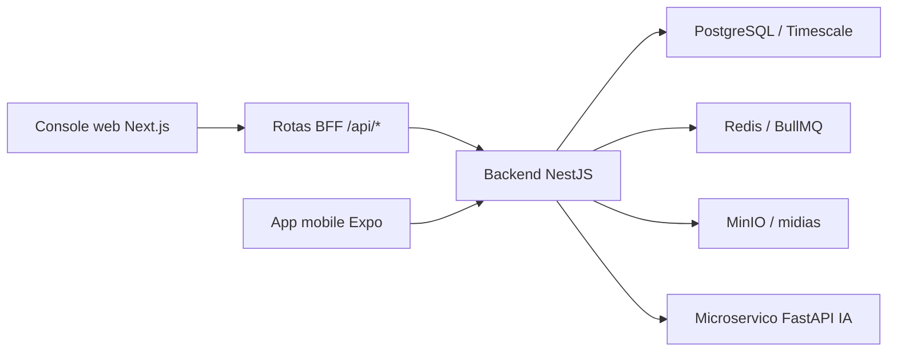

# OctaClin - Handoff tecnico

## Resumo executivo

OctaClin e um sistema clinico modular com backend NestJS, console web Next.js, app mobile Expo e microservico FastAPI para IA. A demo local atual cobre login, questionarios, comunicacoes, automacoes, IA, mobile, gamificacao, operacoes, pacientes e profissionais.

O caminho mais rapido para validar o produto e usar a API demo local com os scripts da raiz `outputs`.

## Demo local

### Subir

```powershell
powershell -ExecutionPolicy Bypass -File outputs/iniciar-demo-local.ps1 -SkipBuild
```

### Acessar

- Web: `http://localhost:3000/login`
- API: `http://localhost:3001`

### Credenciais

- API: `http://localhost:3001`
- Tenant: `clinica-carla`
- Email: `admin@octaclin.local`
- Senha: `OctaClin@123`

### Verificar

```powershell
powershell -ExecutionPolicy Bypass -File outputs/verificar-demo-local.ps1
```

### Parar

```powershell
powershell -ExecutionPolicy Bypass -File outputs/parar-demo-local.ps1
```

## Arquitetura



## Componentes

### Backend

Pasta: `outputs/octaclin-backend`

Stack:

- NestJS 10.
- TypeORM.
- PostgreSQL com multitenancy por `tenant_id`.
- Redis/BullMQ para filas.
- Auditoria operacional em `user_action_logs`.
- Outbox transacional em `outbox_eventos`.

Modulos principais:

- Auth e tenancy.
- Pacientes e profissionais.
- Questionarios e agendamentos.
- Comunicacoes.
- Automacoes.
- IA.
- Mobile.
- Gamificacao.
- Operacoes.

Comandos:

```powershell
cd outputs/octaclin-backend
npm run typecheck
npm run build
npm run test
npm run mock:api
```

Suite focada mais relevante:

```powershell
cd outputs/octaclin-backend
node node_modules/jest/bin/jest.js src/modulos/comunicacoes/aplicacao/servico-comunicacoes.spec.ts src/modulos/automacoes/aplicacao/servico-automacoes.spec.ts src/modulos/ia/aplicacao/servico-ia.spec.ts src/modulos/mobile/aplicacao/servico-mobile.spec.ts src/modulos/gamificacao/aplicacao/servico-gamificacao.spec.ts --runInBand
```

### Web

Pasta: `outputs/octaclin-web`

Stack:

- Next.js 14 App Router.
- React 18.
- TailwindCSS.
- BFF interno em rotas `/api/*`.
- Cookies `HttpOnly` para access/refresh tokens.

Rotas principais:

- `/login`
- `/operacoes`
- `/pacientes`
- `/profissionais`
- `/questionarios`
- `/comunicacoes`
- `/automacoes`
- `/ia`
- `/mobile`
- `/gamificacao`

Comandos:

```powershell
cd outputs/octaclin-web
npm run typecheck
npm run build
npm run smoke:ui
npm run smoke:e2e:bff
```

Fallback sem npm no PATH:

```powershell
cd outputs/octaclin-web
node scripts/smoke-ui-regression.mjs
node scripts/smoke-e2e-bff.mjs
```

### Mobile

Pasta: `outputs/octaclin-mobile`

Stack:

- Expo.
- React Native.
- Expo Router.
- SQLite local.

Funcionalidades entregues:

- Abas para jornada do paciente.
- Diario rapido offline-first.
- Captura de foto, video curto e audio.
- Modo acompanhante com PIN.
- Fila local de sincronizacao.

Comandos:

```powershell
cd outputs/octaclin-mobile
npm run typecheck
npm run start
```

### IA

Pasta: `outputs/octaclin-ai-service`

Stack:

- FastAPI.
- Uvicorn.
- Pydantic.

Endpoints:

- `GET /health`
- `POST /analisar-sentimento`
- `POST /reconhecer-alimento`

Comandos:

```powershell
cd outputs/octaclin-ai-service
python -m venv .venv
.venv\Scripts\activate
pip install -r requirements.txt
uvicorn app.main:app --host 0.0.0.0 --port 8001
```

## Infra local completa

Arquivo: `outputs/docker-compose.yml`

Servicos:

- PostgreSQL/Timescale em `5432`.
- Redis em `6379`.
- MinIO em `9000` e console `9001`.

Subir:

```powershell
cd outputs
docker compose up -d
```

## Seguranca e privacidade

- O tenant e derivado do JWT validado no backend.
- O fluxo removeu dependencia de header de tenant informado pelo cliente.
- Sessao web usa cookies `HttpOnly`.
- O BFF restringe URLs de API e rejeita protocolo invalido, credenciais embutidas, query string e hash.
- Leituras sensiveis e mutacoes administrativas geram auditoria.
- Auditoria nao grava textos, PINs, contatos ou payloads brutos.
- Pacientes e profissionais retornam DTOs autorizados, nao entidades ORM com campos sensiveis.
- Acompanhantes nao expoem `pinHash`.

## Matriz de validacao

Workflow GitHub Actions:

- `outputs/.github/workflows/ci.yml`
- Jobs: backend, web, mobile, ai-service e demo-smoke.
- Nao exige secrets para CI e smoke demo.
- O job demo-smoke tambem roda regressao visual Playwright em desktop e mobile.
- Workflows de deploy AWS/Azure continuam manuais e exigem secrets especificos.

Execucao completa recomendada:

```powershell
powershell -ExecutionPolicy Bypass -File outputs/validar-ci-local.ps1
```

| Camada | Comando | O que cobre |
| --- | --- | --- |
| CI local | `outputs/validar-ci-local.ps1` | Typechecks, builds, specs focadas, demo e smokes |
| Demo local | `outputs/verificar-demo-local.ps1` | Web, API, login BFF, sessao e pacientes |
| Web typecheck | `npm run typecheck` | Tipagem TypeScript do frontend |
| Web build | `npm run build` | Build Next.js e rotas App Router |
| UI smoke | `npm run smoke:ui` | Login, shell, menu e 9 rotas protegidas |
| Visual smoke | `npm run smoke:visual` | Playwright desktop/mobile, screenshots e overflow |
| BFF smoke | `npm run smoke:e2e:bff` | Fluxo BFF, cookies, CRUDs, auditoria e exports |
| Backend typecheck | `npm run typecheck` | Tipagem TypeScript do backend |
| Backend tests | `npm run test` ou specs focadas | Contratos de dominio e servicos |
| Mobile typecheck | `npm run typecheck` | Tipagem do app Expo |

## Criterios de aceite atuais

- Login demo funciona com API, tenant, email e senha seed.
- Todas as rotas protegidas redirecionam sem sessao e renderizam com sessao.
- CRUDs principais de pacientes, profissionais e questionarios passam pelo BFF.
- Comunicacoes, automacoes, IA, mobile e gamificacao persistem/listam registros via BFF.
- Operacoes exibe auditoria, outbox, sincronizacoes, filtros, paginacao e exportacao CSV.
- Auditoria cobre leituras sensiveis e mutacoes administrativas.
- Estados de erro, loading e vazio seguem componentes compartilhados.
- Navegacao responsiva nao gera overflow horizontal nas rotas operacionais validadas.

## Proximos passos recomendados

1. Adicionar Playwright como dependencia de desenvolvimento para screenshots e regressao visual real em CI.
2. Criar pipeline CI que rode typecheck, build, smoke UI e smoke BFF.
3. Evoluir a API demo para cenarios de erro controlado por rota, facilitando QA de estados vazios/erro.
4. Integrar provedores reais de IA mantendo os contratos HTTP atuais.
5. Formalizar ambiente staging com dominios permitidos no BFF e cookies `Secure`.
