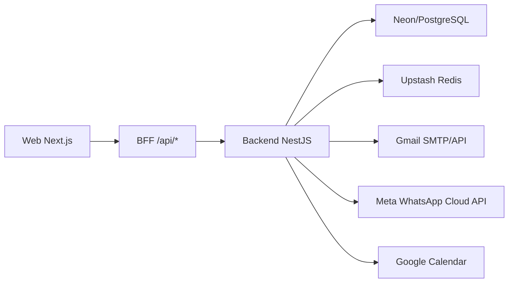

# OctaClin - Handoff tecnico

Atualizado em 2026-07-23, apos a Fase 127.

Este arquivo e um resumo tecnico curto para continuidade. Para contexto completo, leia tambem:

- `AGENTS.md`
- `RESUMO_FASES_CONCLUIDAS.md`
- `CHECKLIST_FASES_FUTURAS_PRODUCAO.md`
- `STATUS_ATUAL_PROJETO.md`
- `PREFLIGHT_PRODUCAO.md`
- `DECISOES_ARQUITETURA.md`
- `MAPA_ROTAS_PERMISSOES.md`
- `TESTES_E_VALIDACOES.md`
- `RUNBOOK_PRODUCAO.md`
- `RUNBOOK_BACKUP_RESTORE.md`
- `RUNBOOK_SUPORTE.md`
- `RUNBOOK_STAGING_DADOS.md`
- `VARIAVEIS_AMBIENTE.md`
- `CHECKLIST_GO_LIVE.md`
- `ONBOARDING_DESENVOLVEDOR.md`
- `COORDENACAO_DESENVOLVIMENTO_IA.md`
- `PACOTE_PROXIMAS_FASES_DESENVOLVEDOR.md`
- `MENSAGEM_HANDOFF_DESENVOLVEDOR.md`
- `FERRAMENTAS_E_PLUGINS_RECOMENDADOS.md`

## Resumo executivo

OctaClin e um sistema SaaS clinico multi-tenant para consultoria, acompanhamento de pacientes, agenda, formularios, comunicacoes e portais por perfil.

O projeto ja possui:

- backend NestJS com TypeORM e PostgreSQL;
- frontend Next.js com BFF em rotas `/api`;
- login unificado por papel;
- portal do paciente;
- portal do cliente;
- console operacional;
- questionarios e formularios;
- agenda interna integrada ao Google Calendar;
- email via Gmail/SMTP/Gmail API;
- WhatsApp Meta Cloud API com webhook, inbox e status;
- LGPD operacional e portal;
- runbooks de producao, backup/restore, rotacao de secrets e suporte;
- suite Playwright de jornadas criticas para cliente, profissional, agenda/comunicacoes e paciente;
- massa ficticia de staging pronta para aplicar no Neon staging;
- convites administrativos para usuarios de cliente;
- modelo de planos SaaS com limites, uso e alertas por tenant;
- solicitacao comercial manual de upgrade/revisao de assinatura;
- controle manual administrativo de assinatura pelo painel operacional;
- bloqueios suaves de assinatura/limite para novas criacoes sem impedir acesso a dados existentes.
- dashboard inicial do profissional com agenda, pacientes, formularios e mensagens.
- prontuario/linha do tempo do paciente para profissional, auditado e consolidando agenda, formularios, respostas e mensagens.
- evolucoes/anotacoes clinicas privadas no prontuario, com conteudo criptografado e auditoria.
- planos de acompanhamento com tarefas/metas/check-ins prescritos no prontuario, descricao criptografada e auditoria.
- biblioteca de materiais educativos com envio ao paciente pelo prontuario.
- agenda com conflitos por profissional, remarcacao/cancelamento e sincronizacao Google Calendar para criar, atualizar e cancelar eventos.

O sistema esta em staging funcional avancado, mas ainda nao deve ser considerado pronto para clientes reais ate concluir o checklist de producao.

## Estrutura atual do repositorio

- `octaclin-backend`: backend NestJS.
- `octaclin-web`: frontend Next.js e BFF.
- `fase-*.md`: historico incremental por fase.
- `RESUMO_FASES_CONCLUIDAS.md`: resumo das fases ja entregues.
- `CHECKLIST_FASES_FUTURAS_PRODUCAO.md`: roadmap vivo ate producao.
- `ONBOARDING_DESENVOLVEDOR.md`: guia de entrada para novo desenvolvedor.
- `COORDENACAO_DESENVOLVIMENTO_IA.md`: fluxo para evitar conflito entre desenvolvedores/agentes.
- `PACOTE_PROXIMAS_FASES_DESENVOLVEDOR.md`: roteiro para avancar varias fases em sequencia.
- `MENSAGEM_HANDOFF_DESENVOLVEDOR.md`: mensagem pronta de repasse.
- `FERRAMENTAS_E_PLUGINS_RECOMENDADOS.md`: acessos e ferramentas recomendadas.

## Credenciais demo locais

Quando o seed demo estiver aplicado:

- API local: `http://localhost:3001`
- Web local: `http://localhost:3000`
- Tenant: `clinica-carla`
- SuperAdmin: `admin@octaclin.local`
- Profissional: `dra.carla@example.com`
- Paciente: `paciente.demo@example.com`
- Cliente: `gestor@octaclin.local`
- Senha demo: `OctaClin@123`

## Arquitetura



## Backend

Pasta: `octaclin-backend`

Principais modulos:

- `auth`: login, refresh token, recuperacao de senha, papeis e permissoes.
- `tenancy`: tenant e executor tenant-aware.
- `usuarios`: entidade base de usuarios.
- `clientes`: portal do cliente, resumo, configuracoes, perfil fiscal, usuarios administrativos, convites, historico de convites, planos SaaS, limites por tenant e solicitacoes comerciais de assinatura.
- `pacientes`: cadastros, portal do paciente, convites e LGPD.
- `profissionais`: cadastro de profissionais.
- `questionarios`: modelos, perguntas, envios e respostas.
- `agenda`: consultas e Google Calendar.
- `comunicacoes`: canais, mensagens, WhatsApp, inbox, notas e outbox.
- `operacoes`: auditoria, LGPD operacional, outbox, suporte e controle manual de assinatura.
- `automacoes`, `ia`, `mobile`, `gamificacao`: dominios operacionais ja iniciados.

Comandos comuns:

```powershell
pnpm --dir octaclin-backend typecheck
pnpm --dir octaclin-backend test -- <specs> --runInBand
pnpm --dir octaclin-backend build
```

## Web

Pasta: `octaclin-web`

Rotas principais:

- `/login`
- `/dashboard`
- `/agenda`
- `/pacientes`
- `/pacientes/[id]`
- `/profissionais`
- `/questionarios`
- `/comunicacoes`
- `/automacoes`
- `/ia`
- `/mobile`
- `/gamificacao`
- `/operacoes`
- `/portal`
- `/cliente`
- `/esqueci-senha`
- `/recuperar-senha`
- `/primeiro-acesso`

Comandos comuns:

```powershell
pnpm --dir octaclin-web typecheck
pnpm --dir octaclin-web test:authz
pnpm --dir octaclin-web build
pnpm --dir octaclin-web exec playwright test tests/visual/portal-cliente.spec.mjs --reporter=list
```

## Seguranca consolidada

- Tenant vem do JWT, nao de input livre.
- Sessao web usa cookies HttpOnly.
- BFF normaliza e restringe API URL.
- PII deve ser criptografada ou retornada por DTO autorizado.
- Pacientes/profissionais usam arquivamento logico.
- Leituras sensiveis e mutacoes relevantes exigem auditoria.
- Tokens e secrets nao devem aparecer em commits ou docs.

## Integracoes externas

- Render: hospedagem atual.
- Neon: PostgreSQL.
- Upstash: Redis.
- Gmail: SMTP e/ou Gmail API.
- Meta: WhatsApp Cloud API.
- Google Calendar: agenda.

Leia `VARIAVEIS_AMBIENTE.md` e `RUNBOOK_PRODUCAO.md` antes de alterar qualquer integracao.

## Estado de roadmap

- Ultima fase concluida: Fase 129 - Staging com dados realistas.
- Proxima fase planejada: Fase 130 - Piloto interno controlado.
- Roadmap completo: `CHECKLIST_FASES_FUTURAS_PRODUCAO.md`.

## Regra de continuidade

Ao concluir qualquer fase:

1. Criar ou atualizar `fase-XXX-*.md`.
2. Atualizar `CHECKLIST_FASES_FUTURAS_PRODUCAO.md`.
3. Atualizar `RESUMO_FASES_CONCLUIDAS.md` se a fase consolidar capacidade.
4. Rodar validacoes.
5. Commitar e fazer push.
