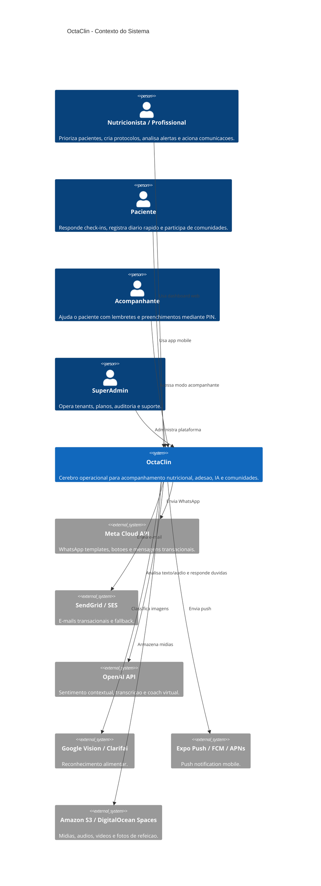
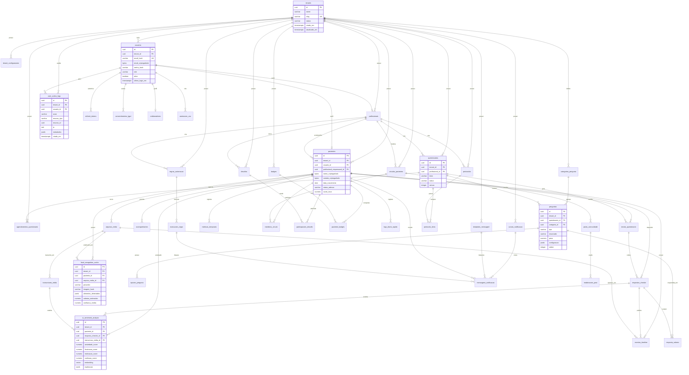

# OctaClin - Fase 0: Fundacao de Arquitetura

## Modulo: Plataforma Operacional Multitenant

### Justificativa Tecnica

- **NestJS + TypeScript**: escolhido para o backend principal por modularidade, injecao de dependencias nativa, suporte maduro a testes com Jest e boa adequacao a DDD em modulos. Alternativas como Express puro reduziriam boilerplate, mas aumentariam acoplamento e custo de manutencao.
- **FastAPI para IA**: isolado do backend principal para separar workloads pesados de texto, audio e imagem. Python tem ecossistema melhor para ML, visao computacional e processamento assíncrono de midia.
- **PostgreSQL 15 + RLS**: escolhido para multitenancy estrito com `tenant_id` obrigatorio e politicas no banco. Schema-per-tenant isola bem, mas aumenta complexidade de migrations, pooling e analytics cross-tenant.
- **pgvector + TimescaleDB**: pgvector cobre buscas semanticas e embeddings; TimescaleDB cobre series temporais de metricas clinicas e adesao.
- **Redis + BullMQ**: separa API sincrona de envios WhatsApp/e-mail, analise de sentimento, reconhecimento alimentar e regras IFTTT.
- **MinIO local / S3 em producao**: mantem paridade operacional para uploads por URL pre-assinada sem depender da AWS em desenvolvimento.

### Trade-offs

| Decisao | Custo | Performance | Manutenibilidade |
|---|---:|---:|---:|
| RLS por `tenant_id` | Baixo | Alto com indices compostos | Alta, uma migration atende todos os tenants |
| Schema-per-tenant | Alto | Medio em escala de tenants | Baixa, migrations e conexoes ficam mais complexas |
| Backend modular monolito no MVP | Baixo | Alto para dominio transacional | Alta, fronteiras DDD claras antes de extrair servicos |
| FastAPI separado para IA | Medio | Alto para jobs pesados | Media, exige observabilidade entre servicos |
| BullMQ para jobs | Baixo | Alto para fan-out | Alta, modelo operacional simples |

### C4 - Diagrama de Contexto

### DER Completo - Mermaid

### Riscos e Mitigacoes

| Risco | Impacto | Mitigacao |
|---|---:|---|
| Politica RLS mal configurada vazar dados entre tenants | Critico | `tenant_id` `NOT NULL`, indices compostos, testes de isolamento e `SET LOCAL app.tenant_id` por transacao |
| Jobs de IA consumirem recursos da API principal | Alto | Separacao FastAPI + BullMQ, filas por prioridade e timeout por provedor |
| Custo de APIs de IA/visao crescer rapido | Alto | Cache por hash de imagem/texto, limites por plano e fallback heuristico |
| WhatsApp templates reprovados ou indisponiveis | Medio | Fallback e-mail/push, monitor de entrega e reprocessamento idempotente |
| Importacao CSV/XLSX com colunas erradas | Medio | Pre-validacao, dry-run, mapeamento assistido e rollback por lote |
| Dados sensiveis fora do modelo LGPD | Alto | Criptografia AES-256, consentimentos versionados, auditoria e anonimizacao |
| Ranking gamificado gerar comparacao negativa | Medio | Rankings opt-in, metricas relativas e moderacao de conteudo sensivel |

### Criterios de Aceite da Fase 0

- DER cobre tenants, RBAC, pacientes, questionarios, IA, midias, comunidades, gamificacao, notificacoes, logs e LGPD.
- Infra local sobe com PostgreSQL, Redis e MinIO.
- Backend NestJS inicial possui DI, TypeORM, migrations e fronteiras DDD para tenancy, usuarios, profissionais e pacientes.
- Multitenancy adotado por RLS com `tenant_id` obrigatorio e politicas no PostgreSQL.
